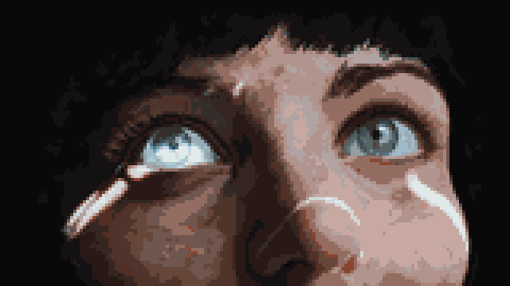
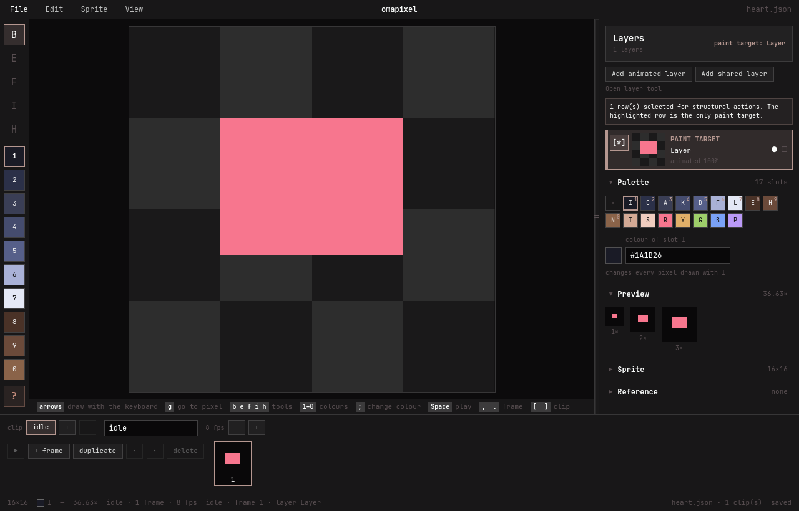

# omapixel

> ### *Pixels, palettes... and prompt.*

**omapixel is a pixel art and animation studio where the document is a text
file, the drawing is a list of commands, and a human and an agent edit the same
open document at the same time.**

## Made with omapixel

<table>
  <tr>
    <td width="62%" align="center">
      <a href="examples/last-horizon-omarchy/last-horizon-omarchy.omapixel">
        
      </a>
    </td>
    <td width="38%" align="center">
      <a href="examples/escape-from-omarchy/escape-from-omarchy.omapixel">
        
      </a>
    </td>
  </tr>
  <tr>
    <td align="center"><sub><strong>Last Horizon × Omarchy × Omapixel</strong><br>The photograph was imported. The ordered-dither dissolve, the pixel lettering and the two-beat heart across 109 frames were not.</sub></td>
    <td align="center"><sub><strong>Escape from Omarchy</strong><br>The newspaper was imported. The pan, the letter-by-letter turn from Oligarchy into Omarchy, and the layering across 102 frames were not.</sub></td>
  </tr>
</table>

Both previews come from editable `.omapixel` projects. Open one in the Studio,
inspect every layer and frame, or [browse all examples](examples/).

## Marking work for the agent

Select a rectangle in the Studio. The agent reads exactly what you marked:

```bash
$ omapixel where heart.json
{"sessions":[{"pid":1234,"path":"/work/heart.json","dirty":false,
  "view":{"clip":"idle","frame":0,"layerId":"hero","scope":"frame"},
  "selection":{"clip":"idle","frame":0,"layerId":"hero",
               "x":2,"y":3,"width":6,"height":7,"count":42}}]}
```

"Fix the left eye" is ambiguous. A rectangle with a clip, a frame and a layer is
not. `dirty` says whether you have unsaved strokes before the agent writes, and
if it does land on top of your work, one Ctrl+Z brings your version back.

The endpoint is authenticated per process. The CLI never reads Studio selection
state on its own — `where` is the one place it is offered, and only on request.

## This logo was drawn from an empty grid


No image was imported. The whole source is thirteen lines:

```
line --from 3,3 --to 6,3 --slot R
line --from 9,3 --to 12,3 --slot R
line --from 2,4 --to 13,4 --slot R
...
# a specular highlight, so it reads as drawn and not as a glyph
line --from 4,4 --to 5,4 --slot S
paint --at 3,5 --slot S
```

That comment is the agent's. Run the file yourself — the same batch gives back
the same picture, byte for byte:

```bash
omapixel new icon.json --size 16x16
omapixel batch icon.json --script packaging/icon/omapixel.batch
omapixel show icon.json
```

An agent asked for 256 pixel values produces noise. An agent asked for ten lines
produces a drawing. That is the whole design: the interface is geometry and
palette, never a grid of colours.

The full source, and how the `.svg` the desktop installs is derived from it, is
in [`packaging/icon/`](packaging/icon/).

## Why this is different

Three claims, and the command that settles each one.

**The source is text, so art lives in git.**

```bash
omapixel diff before.json after.json
```

A binary sprite gives you two pictures to compare. A text document gives you a
line to comment on. You cannot ask an onion skin why a row moved.

**A pixel stores a palette slot, not a colour.**

```bash
omapixel palette heart.json set --slot R --colour "#F7768E"
```

`R` is a letter in the document; the palette holds the colour. There is no other
representation, so recolouring every `R` across a 109-frame animation is one
edit, not a hundred and nine. See [the format](docs/format.md).

**The agent can see what it drew.**

```bash
omapixel text heart.json
```

The composite comes back as letters, on stdout, with no window and no
screenshot. An agent that cannot see its own work is guessing, and you end up
reviewing every attempt by hand.

## How it works

1. `omapixel new` writes a document, or open one that already exists.
2. Draw: `paint`, `line`, `rect`, `fill`, `edit`, from a prompt, a script or the
   studio.
3. Look: `text` for the letters, `show` for the terminal, `render` for a PNG.
4. Animate with `clip` and `frame`; the studio plays it back, looping or not.
5. Hand over the JSON, compressed `.omapixel`, a PNG, or a sprite sheet.

Anything generated goes through `batch`: one pass over one document, read once
and written once. Everything an agent does should go through it.

## Quickstart

On Omarchy:

```bash
sudo pacman -S omapixel
omapixel skill install # teach supported coding agents how to drive it
```

From a checkout:

```bash
mise run deps      # says what is missing and how to install it
mise run build     # the command line and the studio
mise run install   # into ~/.local/bin
```

Draw something and look at it without leaving the terminal:

```bash
omapixel new heart.json --size 16x16
omapixel rect heart.json --from 4,4 --to 11,9 --slot R --filled
omapixel show heart.json
```

Use a `.omapixel` suffix when the editable document should be compressed;
`.json` remains the default readable interchange form:

```bash
omapixel new animation.omapixel --size 160x90
omapixel-studio animation.omapixel
```

The Studio's Save As dialog offers both representations and subsequent saves
preserve the selected one.

Then open the same file in the window:

```bash
omapixel-studio heart.json
```

New here? Start with [Getting started](docs/getting-started.md).

## Looking at what got drawn

Three commands answer "what is actually there?":

```bash
omapixel text   heart.json                    # the composite, flattened to palette slots
omapixel show   heart.json                    # the composite in the terminal
omapixel render heart.json -o h.png --scale 12 --sheet
omapixel render heart.json -o layer.png --isolated --layer-id hero
omapixel render heart.json -o animation.gif --format gif --fps 12 --loop
```

These surfaces use the visible bottom-to-top composite by default. `--isolated
--layer-id ID` or an exact `--layer NAME` renders one visible layer with its
opacity, without its neighbours. `text` keeps transparent pixels as `.`, while
`show` and PNG retain composed RGBA; `--checker` is a final background for those
visual surfaces and is never written into a layer. `render --sheet` applies the
selected view to every frame side by side.

Without these, a complete command set still leaves somebody screenshotting a
running window. With them, the window is optional.

Layer stack control is available without opening Studio:

```bash
omapixel layer heart.json list
omapixel layer heart.json rename --layer-id hero --name "Main Hero"
omapixel layer heart.json move --layer-id hero --index 1
```

Multilayer mutations require explicit layer identity. See [the CLI
reference](docs/cli.md) for scope, lock/hidden safety, batch behavior, and
`flatten` reports.

## Commands

| Command | What it does |
| :--- | :--- |
| `new` `info` `check` | make one, describe one, say what is wrong with one |
| `show` `text` `render` | look at one: in the terminal, as letters, as PNG or animated GIF |
| `paint` `line` `rect` `fill` | draw |
| `edit` | `clear` `shift` `flip` `swap` over a whole frame |
| `clip` `frame` | `add` `dup` `rm` `move` `rename` `fps` |
| `palette` | `list` `set` `rm` |
| `resize` `trim` | resize around the centre, or remove empty outer borders |
| `layer` `flatten` | inspect and control the layer stack, or write a composite |
| `batch` | many commands over one document, read once and written once |
| `diff` | what differs between two documents |
| `where` | which live studios hold a document, and what is selected in them |
| `import` `export` | read and write somebody else's sprite catalog |
| `import-image` | turn PNG, JPEG or WebP into a new document or layer |
| `config` `i18n` | the settings file, and what a translation is missing |
| `skill` | inspect or install the Omapixel skill for coding agents |
| `plugin` | list, check and run local export plugins |

`--clip` and `--frame` default to the first clip and frame 0, so a document with
one clip needs no flags at all. Exit `1` means the answer was no; exit `2` means
the command was wrong.

> **Use `batch` for generated art.** It applies many commands after one read and
> commits once, instead of starting a process and rewriting the document for
> every operation.

The complete cross-surface gate is `mise run check`. It includes offscreen
Studio/CLI fixtures, deterministic v2 properties, i18n coverage and the canonical
performance benchmark. The workload and stop limits are in [How it is
built](docs/design.md#tests-and-acceptance).

## Plugins, for the formats that are not here

An export plugin is a separate executable, in any language. omapixel speaks to
it over a pipe, and the contract is short enough to read in one sitting.

The host validates the document, drops a snapshot into a private workspace and
starts the plugin there. One JSON request goes in on stdin:

```json
{"type":"request","requestId":"req-1","action":"png","document":"input/document.json","outputDir":"output","params":[{"key":"scale","value":"2"}]}
```

JSONL comes back on stdout: any number of progress records, then exactly one
result.

```json
{"type":"progress","requestId":"req-1","message":"encoding","percent":50}
{"type":"result","requestId":"req-1","ok":true,"artifact":"sprite.png"}
```

The plugin writes inside `output/` and names the file. It never chooses where
that file lands — the host publishes it atomically to the `--out` you gave, and
only after a clean exit and a valid result. A crash, a timeout, an unexpected
line on stdout, or an artifact reaching outside the workspace is a failed
invocation, and your destination is left untouched.

```bash
omapixel plugin list
omapixel plugin check example-exporter
omapixel plugin run example-exporter png art.json --out sprite.png --param scale=2
```

`list` and `check` only read manifests; they never start anything. Execution is
bounded: sixty seconds, a megabyte of protocol, one artifact of at most 64 MiB.
The plugin inherits `PATH`, `HOME`, `LANG`, `LC_ALL`, `LC_CTYPE` and `TMPDIR`,
and nothing else of yours.

Plugins are trusted, unsandboxed executables. The workspace protects your
document and your destination from a plugin that is *wrong*; it is not a
security boundary against one that is *hostile*. Read a plugin before you copy
it into place.

[Plugin API 1](docs/plugins.md) is the whole contract: the manifest schema,
discovery order, every limit, and the failure matrix that `mise run plugin-e2e`
exercises.

## The studio, for when you take over

```bash
omapixel-studio person.json
```



Tools and the ten colours in hand down the left, the drawing in the middle,
layers and inspector panels on the right, the clip and its frames along the
bottom, and a bar of live keys under the canvas.

- **Every control is reachable from the keyboard.** A cursor walks the drawing a
  pixel at a time and paints where it stands; <kbd>Tab</kbd> walks the window;
  <kbd>Esc</kbd> always hands the keyboard back to the drawing.
- **It wears your omarchy theme**, live. `omarchy theme set` recolours it
  without a restart, corner rounding included. Your art never changes colour
  because your desktop did.
- **It follows the file you have open**, live. An agent editing through the
  command line lands in the window as it happens, the status line says what
  changed, and if it replaced unsaved work one Ctrl+Z brings your version
  back. Even an untitled window is backed by a runtime file, so "draw something"
  works before any save.
- **Its settings and every keybinding are one TOML file** in the shape the rest
  of an omarchy machine uses, watched, so saving it rebinds the keys while the
  window is open.
- **Its words come from a JSON file per language**, so translating is copying
  one file and changing the right-hand sides.

## What this is not

Not a replacement for drawing by hand. Aseprite's canvas is better than this one
and will stay better; if you sit down to illustrate for an afternoon, use it.

omapixel is for art that is *specified*: icons, tiles, UI, palette work, sprite
catalogues, and animation with a rule behind it — a dissolve, a pan, a pulse, a
sequence too long to hand-place. Those are the jobs where the drawing is a
program, and where a program should be the source.

Original illustration with volume and hand-tuned anti-aliasing is still a human's
job. Geometry, palette and timing are where an agent is good, and that is what
this is shaped for.

## Learn more

Full docs live in [`docs/`](docs/).

- **[Getting started](docs/getting-started.md)**: draw, animate and export something, start to finish.
- **[Dependencies](docs/dependencies.md)**: runtime, checkout, WebP, and test environments.
- **[Examples](examples/)**: editable projects paired with their rendered GIF previews.
- **[The command line](docs/cli.md)**: every command, every flag, with examples.
- **[The studio](docs/studio.md)**: the window, its panels and its keys.
- **[The format](docs/format.md)**: the schema, composition rules, and layer behavior.
- **[Plugins](docs/plugins.md)**: install, inspect, run, or author an API 1 export plugin.
- **[Settings and keys](docs/configuration.md)**: one TOML file, every setting, every binding.
- **[Adding a language](docs/i18n.md)**: translate the JSON catalogue and check its coverage.
- **[How it is built](docs/design.md)**: one core, two front ends, and why it is shaped this way.

## License

omapixel is available under the [MIT License](LICENSE).

---

<sub>Built for [Omarchy](https://omarchy.org) with [Omakiten](https://github.com/This-Is-NPC/omakiten).</sub>
