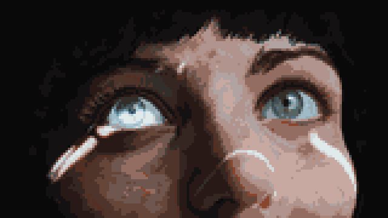
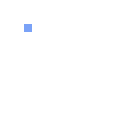

# Examples

Each example has a dedicated directory containing only its compressed
`.omapixel` project and a `.gif` preview.

| Preview | Project | Description |
|---|---|---|
| <a href="last-horizon-omarchy/last-horizon-omarchy.omapixel"></a> | [`last-horizon-omarchy`](last-horizon-omarchy/) | The photograph dissolving into the retro-82 Omarchy wallpaper, an Omapixel signature with a two-beat heart animation, and back; 109 frames at 12 fps. |
| <a href="escape-from-omarchy/escape-from-omarchy.omapixel"></a> | [`escape-from-omarchy`](escape-from-omarchy/) | 329×480 newspaper animation ending with Oligarchy transforming into Omarchy, an Omapixel signature, and a beating heart; 102 frames at 8 fps. |
| <a href="last-horizon/last-horizon.omapixel"></a> | [`last-horizon`](last-horizon/) | 160×90 photograph reduced to pixel art. |
| <a href="heart/heart.omapixel"></a> | [`heart`](heart/) | 16×16, two-frame drawing from [Getting started](../docs/getting-started.md). |
| <a href="drawn-heart/drawn-heart.omapixel"></a> | [`drawn-heart`](drawn-heart/) | The Omapixel heart drawn and erased one row at a time. |
| <a href="pixel-pulse/pixel-pulse.omapixel"></a> | [`pixel-pulse`](pixel-pulse/) | The complete heart contracting and expanding. |
| <a href="particle-assembly/particle-assembly.omapixel"></a> | [`particle-assembly`](particle-assembly/) | Loose pixels gathering into the heart and dispersing. |
| <a href="layer-composite/layer-composite.omapixel"></a> | [`layer-composite`](layer-composite/) | Separate animated halves meeting and separating. |
| <a href="controlled-glitch/controlled-glitch.omapixel"></a> | [`controlled-glitch`](controlled-glitch/) | Shifted rows with blue and purple pixel echoes. |
| <a href="editor-cursor/editor-cursor.omapixel"></a> | [`editor-cursor`](editor-cursor/) | A blue cursor painting and erasing the heart. |
| <a href="draw-and-pulse/draw-and-pulse.omapixel"></a> | [`draw-and-pulse`](draw-and-pulse/) | The heart being drawn, pulsing, and disappearing. |

Open a project in the Studio or inspect it from the command line:

```bash
mise run studio examples/last-horizon/last-horizon.omapixel
omapixel show examples/last-horizon/last-horizon.omapixel
```
